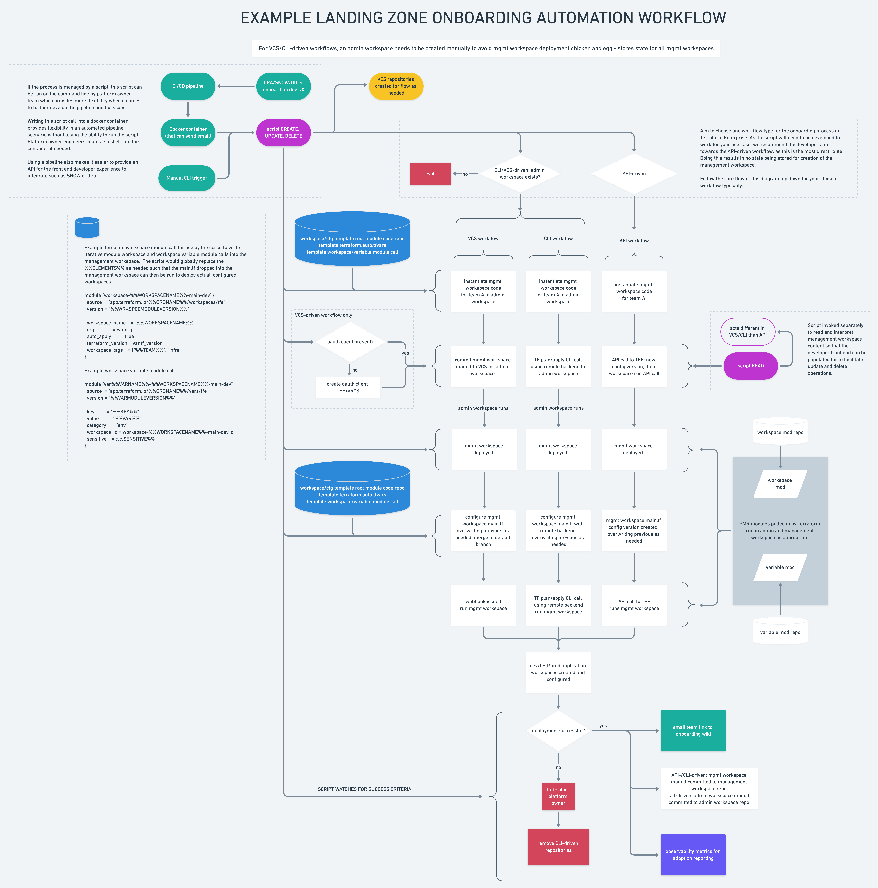

# tlz-automation
Example Terraform Enterprise landing zone deployment automation tool.

The main functionality of this script is the API pathway in this diagram:



## Start Here

* Run
```bash
pip install -r requirements.txt
```
* Then run something like
```bash
eliza -t my_tfe.example.com -s team-app1 -c -o my_org
```
